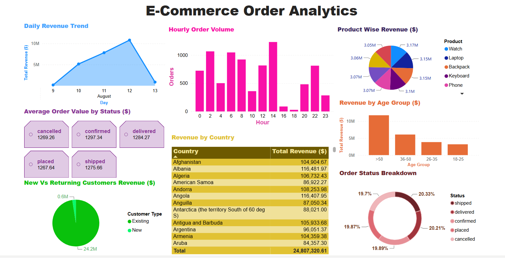
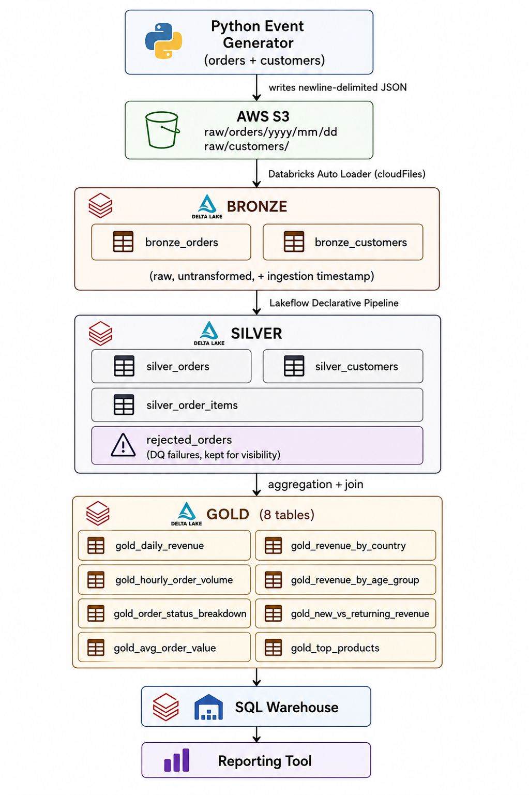
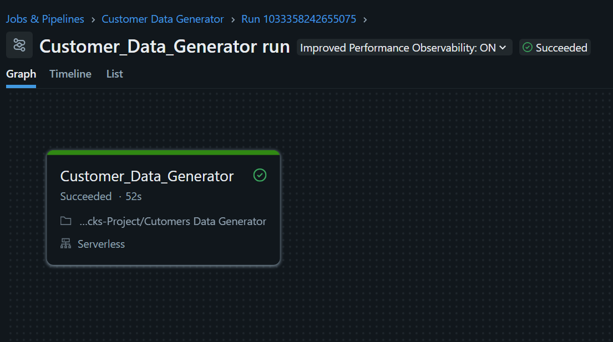
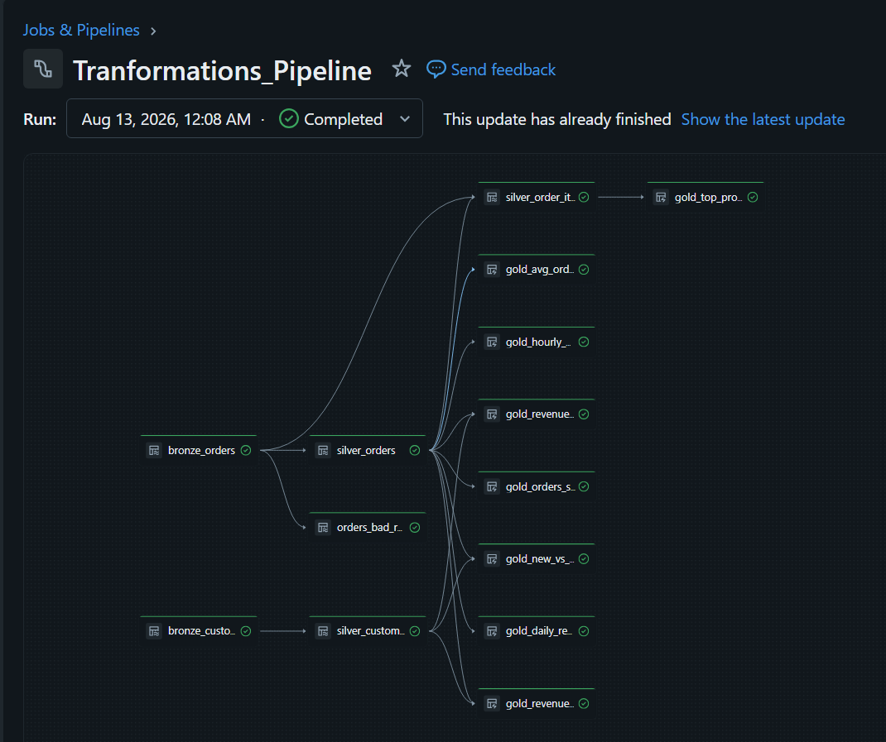
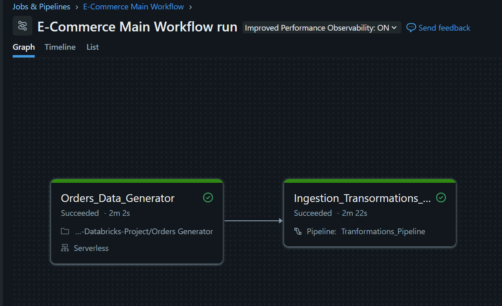

# Real-Time E-Commerce Lakehouse Pipeline

A near-real-time streaming data pipeline built on Databricks, simulating an e-commerce order system end-to-end — from event generation through a validated Medallion (Bronze/Silver/Gold) architecture, ready for BI reporting.

Built as a personal project to gain hands-on streaming/lakehouse experience alongside daily batch ETL work.

Dashboard Link - [E-Commerce Order Analytics](https://app.powerbi.com/view?r=eyJrIjoiYzkyMmVjNmUtMjgyNi00ZGNkLWJlM2UtMWM3OGUzNDQxZmVjIiwidCI6IjAzODkyNDQyLWUwYzMtNDk5MS04MjBjLWM3ZTc1NzdmMjNkMSJ9)

## Architecture

## Tech Stack

Python · AWS S3 · Databricks Auto Loader · Lakeflow Declarative Pipelines (Delta Live Tables) · Delta Lake · Databricks SQL Warehouse · Power BI

## Data Sources

- **Orders** (fact/event stream) — generated continuously in batches, simulating live order traffic
- **Customers** (dimension) — generated once as a fixed pool; orders reference real customer IDs from this pool, so repeat-customer behavior occurs naturally

## Medallion Layers

**Bronze** — Raw ingestion via Auto Loader, incremental file discovery from S3, zero transformation beyond an `_ingested_at` timestamp. Kept as an unmodified mirror of the source so any downstream layer can be reprocessed without re-fetching from S3.

**Silver** — Deduplication, type casting, and data quality enforcement via `expect_or_drop` expectations (e.g. positive amounts, valid order status, non-null IDs). Rows failing validation are not silently dropped — they're captured in `rejected_orders` for visibility. `silver_order_items` flattens the nested items array and is filtered to only include items belonging to orders that passed `silver_orders` validation (referential integrity across Silver tables).

**Gold** — Business-facing aggregations: revenue trends (daily/hourly), order status breakdown, average order value, top products, and customer-segmented revenue (by country, age group, new vs. returning).

## Mail Workflow

## Possible Future Improvements

- Continuous pipeline mode with dedicated compute for true low-latency streaming
- AWS Secrets Manager / Databricks Secrets for credential management
- Watermarking on streaming deduplication to bound state growth over time
